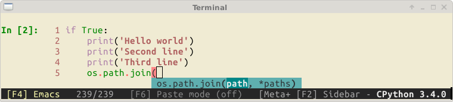

Python Prompt Toolkit
=====================

.. warning::

    Please notice that this is the documentation for the 2.0 branch of
    prompt_toolkit. It is incompatible with the 1.0 branch, but much better in
    many regards. On Pypi you'll still find the 1.0 branch, but a release
    should follow soon. In the meantime, don't hesitate to test this branch and
    report any bugs.

`prompt_toolkit` is a library for building powerful interactive command line
and terminal applications in Python.

It can be a very advanced pure Python replacement for `GNU readline
<http://cnswww.cns.cwru.edu/php/chet/readline/rltop.html>`_, but it can also be
used for building full screen applications.

Some features:

- Syntax highlighting of the input while typing. (For instance, with a Pygments lexer.)
- Multi-line input editing.
- Advanced code completion.
- Selecting text for copy/paste. (Both Emacs and Vi style.)
- Mouse support for cursor positioning and scrolling.
- Auto suggestions. (Like `fish shell <http://fishshell.com/>`_.)
- No global state.

Like readline:

- Both Emacs and Vi key bindings.
- Reverse and forward incremental search.
- Works well with Unicode double width characters. (Chinese input.)

Works everywhere:

- Pure Python. Runs on all Python versions from 2.6 up to 3.4.
- Runs on Linux, OS X, OpenBSD and Windows systems.
- Lightweight, the only dependencies are Pygments, six and wcwidth.
- No assumptions about I/O are made. Every prompt_toolkit application should
  also run in a telnet/ssh server or an `asyncio
  <https://docs.python.org/3/library/asyncio.html>`_ process.

Have a look at :ref:`the gallery <gallery>` to get an idea of what is possible.

Getting started
---------------

Go to :ref:`getting started <getting_started>` and build your first prompt.

Thanks to:
----------

A special thanks to `all the contributors
<https://github.com/jonathanslenders/python-prompt-toolkit/graphs/contributors>`_
for making prompt_toolkit possible.

Also, a special thanks to the `Pygments <http://pygments.org/>`_ and `wcwidth
<https://github.com/jquast/wcwidth>`_ libraries.

Table of contents
-----------------

.. toctree::
   :maxdepth: 3

   pages/gallery
   pages/getting_started
   pages/upgrading
   pages/printing_text
   pages/asking_for_input
   pages/dialogs
   pages/full_screen_apps
   pages/advanced_topics/index
   pages/reference

Indices and tables
==================

* :ref:`genindex`
* :ref:`modindex`
* :ref:`search`

Prompt_toolkit was created by `Jonathan Slenders
<http://github.com/jonathanslenders/>`_.
