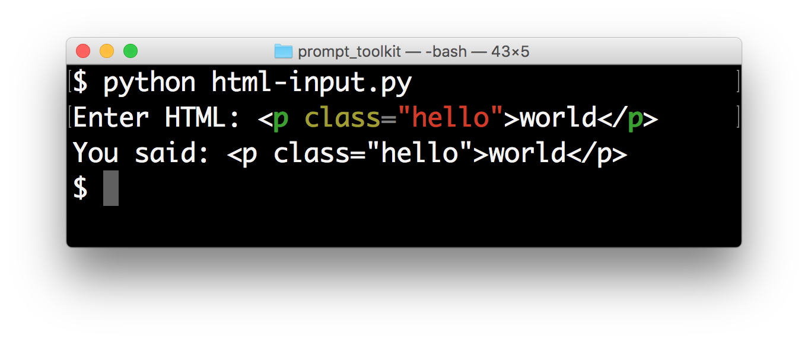
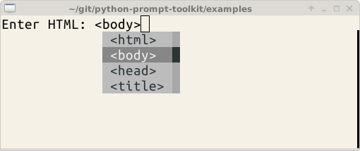
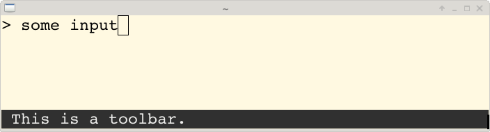
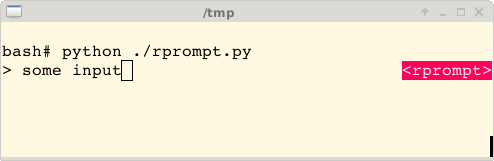

.. _asking_for_input:

Asking for input (prompts)
==========================

This page is about building prompts. Pieces of code that we can embed in a
program for asking the user for input. If you want to use `prompt_toolkit` for
building full screen terminal applications, it is probably still a good idea to
read this first, before heading to the :ref:`building full screen applications
<full_screen_applications>` page.

Hello world
-----------

The following snippet is the most simple example, it uses the
:func:`~prompt_toolkit.shortcuts.prompt` function to asks the user for input
and returns the text. Just like ``(raw_)input``.

.. code:: python

    from __future__ import unicode_literals
    from prompt_toolkit import prompt

    text = prompt('Give me some input: ')
    print('You said: %s' % text)

What we get here is a simple prompt that supports the Emacs key bindings like
readline, but further nothing special. However,
:func:`~prompt_toolkit.shortcuts.prompt` has a lot of configuration options.
In the following sections, we will discover all these parameters.

.. note::

    `prompt_toolkit` expects unicode strings everywhere. If you are using
    Python 2, make sure that all strings which are passed to `prompt_toolkit`
    are unicode strings (and not bytes). Either use
    ``from __future__ import unicode_literals`` or explicitely put a small
    ``'u'`` in front of every string.

The `Prompt` object
-------------------

Instead of calling the :func:`~prompt_toolkit.shortcuts.prompt` function, it's
also possible to create a :func:`~prompt_toolkit.shortcuts.Prompt` instance
followed by calling its :meth:`~prompt_toolkit.shortcuts.Prompt.prompt` method
for every input call. This creates a kind of an input session.

.. code:: python

    from prompt_toolkit import Prompt

    # Create prompt object.
    our_prompt = Prompt()

    # Do multiple input calls.
    text1 = our_prompt.prompt()
    text2 = our_prompt.prompt()

This has mainly two advantages:

- The input history will be kept between concecutive
  :meth:`~prompt_toolkit.shortcuts.Prompt.prompt` calls.

- The :func:`~prompt_toolkit.shortcuts.Prompt` instance and its
  :meth:`~prompt_toolkit.shortcuts.Prompt.prompt` method take about the same
  arguments, like all the options described below (highlighting, completion,
  etc...). So if you want to ask for multiple inputs, but each input call needs
  about the same arguments, they can be passed to the
  :func:`~prompt_toolkit.shortcuts.Prompt` instance as well, and they can be
  overridden by passing values to the
  :meth:`~prompt_toolkit.shortcuts.Prompt.prompt` method.

Syntax highlighting
-------------------

Adding syntax highlighting is as simple as adding a lexer. All of the `Pygments
<http://pygments.org/>`_ lexers can be used after wrapping them in a
:class:`~prompt_toolkit.layout.lexers.PygmentsLexer`. It is also possible to
create a custom lexer by implementing the
:class:`~prompt_toolkit.layout.lexers.Lexer` abstract base class.

.. code:: python

    from pygments.lexers import HtmlLexer
    from prompt_toolkit.shortcuts import prompt
    from prompt_toolkit.layout.lexers import PygmentsLexer

    text = prompt('Enter HTML', lexer=PygmentsLexer(HtmlLexer))
    print('You said: %s' % text)

.. _colors:

Colors
------

The colors for syntax highlighting are defined by a
:class:`~prompt_toolkit.styles.Style` instance. By default, a neutral
built-in style is used, but any style instance can be passed to the
:func:`~prompt_toolkit.shortcuts.prompt` function. A simple way to create a
style, is by using the :meth:`~prompt_toolkit.styles.Style.from_dict`
function:

.. code:: python

    from pygments.lexers import HtmlLexer
    from prompt_toolkit.shortcuts import prompt
    from prompt_toolkit.styles import Style
    from prompt_toolkit.layout.lexers import PygmentsLexer

    our_style = style.from_dict({
        'pygments.comment':   '#888888 bold',
        'pygments.keyword':   '#ff88ff bold',
    })

    text = prompt('Enter HTML: ', lexer=PygmentsLexer(HtmlLexer),
                  style=our_style)

The style dictionary is very similar to the Pygments ``styles`` dictionary,
with a few differences:

- The `roman`, `sans`, `mono` and `border` options are ignored.
- The style has a few additions: ``blink``, ``noblink``, ``reverse`` and ``noreverse``.
- Colors can be in the ``#ff0000`` format, but they can be one of the built-in
  ANSI color names as well. In that case, they map directly to the 16 color
  palette of the terminal.

Using a Pygments style
^^^^^^^^^^^^^^^^^^^^^^

All Pygments style classes can be used as well, when they are wrapped through
:func:`~prompt_toolkit.styles.style_from_pygments`.

Suppose we'd like to use a Pygments style, for instance
``pygments.styles.tango.TangoStyle``, that is possible like this:

Creating a custom style could be done like this:

.. code:: python

    from prompt_toolkit.shortcuts import prompt
    from prompt_toolkit.styles import style_from_pygments, merge_style
    from prompt_toolkit.layout.lexers import PygmentsLexer

    from pygments.styles.tango import TangoStyle
    from pygments.lexers import HtmlLexer

    our_style = merge_style([
        style_from_pygments(TangoStyle),
        Style.from_dict({
            'pygments.comment': '#888888 bold',
            'pygments.keyword': '#ff88ff bold',
        })
    ])

    text = prompt('Enter HTML: ', lexer=PygmentsLexer(HtmlLexer),
                  style=our_style)

Coloring the prompt itself
^^^^^^^^^^^^^^^^^^^^^^^^^^

It is possible to add some colors to the prompt itself. For this, we need a
``get_prompt`` function. This is a function that can return a string, but also
a list of ``(style, text)`` tuples.

.. code:: python

    from prompt_toolkit.shortcuts import prompt
    from prompt_toolkit.styles import Style

    style = Style.from_dict({
        # User input.
        '':          '#ff0066',

        # Prompt.
        'username': '#884444',
        'at':       '#00aa00',
        'colon':    '#00aa00',
        'pound':    '#00aa00',
        'host':     '#000088 bg:#aaaaff',
        'path':     '#884444 underline',
    })

    def get_prompt():
        return [
            ('class:username', 'john'),
            ('class:at',       '@'),
            ('class:host',     'localhost'),
            ('class:colon',    ':'),
            ('class:path',     '/user/john'),
            ('class:pound',    '# '),
        ]

    text = prompt(get_prompt, style=style)

By default, colors are taking from the 256 color palette. If you want to have
24bit true color, this is possible by adding the ``true_color=True`` option to
the :func:`~prompt_toolkit.shortcuts.prompt.prompt`` function.

.. code:: python

    text = prompt(get_prompt, style=style, true_color=True)

Autocompletion
--------------

Autocompletion can be added by passing a ``completer`` parameter. This should
be an instance of the :class:`~prompt_toolkit.completion.Completer` abstract
base class. ``WordCompleter`` is an example of a completer that implements that
interface.

.. code:: python

    from prompt_toolkit import prompt
    from prompt_toolkit.contrib.completers import WordCompleter

    html_completer = WordCompleter(['<html>', '<body>', '<head>', '<title>'])
    text = prompt('Enter HTML: ', completer=html_completer)
    print('You said: %s' % text)

``WordCompleter`` is a simple completer that completes the last word before the
cursor with any of the given words.

.. note::

    Note that in prompt_toolkit 2.0, the auto completion became synchronous. This
    means that if it takes a long time to compute the completions, that this
    will block the event loop and the input processing.

    For heavy completion algorithms, it is recommended to wrap the completer in
    a :class:`~prompt_toolkit.completion.ThreadedCompleter` in order to run it
    in a background thread.

A custom completer
^^^^^^^^^^^^^^^^^^

For more complex examples, it makes sense to create a custom completer. For
instance:

.. code:: python

    from prompt_toolkit import prompt
    from prompt_toolkit.completion import Completer, Completion

    class MyCustomCompleter(Completer):
        def get_completions(self, document, complete_event):
            yield Completion('completion', start_position=0)

    text = prompt('> ', completer=MyCustomCompleter())

A :class:`~prompt_toolkit.completion.Completer` class has to implement a
generator named :meth:`~prompt_toolkit.completion.Completer.get_completions`
that takes a :class:`~prompt_toolkit.document.Document` and yields the current
:class:`~prompt_toolkit.completion.Completion` instances. Each completion
contains a portion of text, and a position.

The position is used in for fixing text before the cursor. Pressing the tab key
could for instance turn parts of the input from lowercase to uppercase. This
makes sense for a case insensitive completer. Or in case of a fuzzy completion,
it could fix typos. When ``start_position`` is something negative, this amount
of characters will be deleted and replaced.

Asynchronous completion
^^^^^^^^^^^^^^^^^^^^^^^

When generating the completions takes a lot of time, it's better to do this in
a background thread. This is possible by wrapping the completer in a
:class:`~prompt_toolkit.completion.ThreadedCompleter`, but also by passing the
`complete_in_thread=True` argument.

.. code:: python

    text = prompt('> ', completer=MyCustomCompleter(), complete_in_thread=True)

Input validation
----------------

A prompt can have a validator attached. This is some code that will check
whether the given input is acceptable and it will only return it if that's the
case. Otherwise it will show an error message and move the cursor to a given
possition.

A validator should implements the :class:`~prompt_toolkit.validation.Validator`
abstract base class. This requires only one method, named ``validate`` that
takes a :class:`~prompt_toolkit.document.Document` as input and raises
:class:`~prompt_toolkit.validation.ValidationError` when the validation fails.

.. code:: python

    from prompt_toolkit.validation import Validator, ValidationError
    from prompt_toolkit import prompt

    class NumberValidator(Validator):
        def validate(self, document):
            text = document.text

            if text and not text.isdigit():
                i = 0

                # Get index of fist non numeric character.
                # We want to move the cursor here.
                for i, c in enumerate(text):
                    if not c.isdigit():
                        break

                raise ValidationError(message='This input contains non-numeric characters',
                                      cursor_position=i)

    number = int(prompt('Give a number: ', validator=NumberValidator()))
    print('You said: %i' % number)

History
-------

A :class:`~prompt_toolkit.history.History` object keeps track of all the
previously entered strings. When nothing is passed into the
:func:`~prompt_toolkit.shortcuts.prompt` function, it will start with an empty
history each time again. Usually, however, for a REPL, you want to keep the
same history between several calls to
:meth:`~prompt_toolkit.shortcuts.prompt`. This is possible by instantiating a
:class:`~prompt_toolkit.history.History` object and passing that to each
:meth:`~prompt_toolkit.shortcuts.prompt` call as follows:

.. code:: python

    from prompt_toolkit.history import InMemoryHistory
    from prompt_toolkit import prompt

    history = InMemoryHistory()

    while True:
        prompt(history=history)

To persist a history to disk, use :class:`~prompt_toolkit.history.FileHistory`
instead instead of :class:`~prompt_toolkit.history.InMemoryHistory`.

.. note::

    Note that the same result as in the example above (with an
    :class:`~prompt_toolkit.history.InMemoryHistory`) can be achieved by
    creating a :func:`~prompt_toolkit.shortcuts.Prompt` instance.

   .. code:: python

       from prompt_toolkit import Prompt

       p = Prompt()

       while True:
           p.prompt()

Auto suggestion
---------------

Auto suggestion is a way to propose some input completions to the user like the
`fish shell <http://fishshell.com/>`_.

Usually, the input is compared to the history and when there is another entry
starting with the given text, the completion will be shown as gray text behind
the current input. Pressing the right arrow :kbd:`→` will insert this suggestion.

.. note::

    When suggestions are based on the history, don't forget to share one
    :class:`~prompt_toolkit.history.History` object between consecutive
    :func:`~prompt_toolkit.shortcuts.prompt` calls.

Example:

.. code:: python

    from prompt_toolkit import prompt
    from prompt_toolkit.history import InMemoryHistory
    from prompt_toolkit.auto_suggest import AutoSuggestFromHistory

    history = InMemoryHistory()

    while True:
        text = prompt('> ', history=history, auto_suggest=AutoSuggestFromHistory())
        print('You said: %s' % text)

A suggestion does not have to come from the history. Any implementation of the
:class:`~prompt_toolkit.auto_suggest.AutoSuggest` abstract base class can be
passed as an argument.

Adding a bottom toolbar
-----------------------

Adding a bottom toolbar is as easy as passing a ``bottom_toolbar`` function to
:func:`~prompt_toolkit.shortcuts.prompt`. The function is called every time the
prompt is rendered (at least on every key stroke), so the bottom toolbar can be
used to display dynamic information. It should return formatted text or a list
of ``(style, text)`` tuples. The toolbar is always erased when the prompt
returns.

.. code:: python

    from prompt_toolkit import prompt
    from prompt_toolkit.styles import Style

    def bottom_toolbar():
        return [('class:bottom-toolbar', ' This is a toolbar. ')]

    style = Style.from_dict({
        'class:bottom-toolbar': '#ffffff bg:#333333',
    })

    text = prompt('> ', bottom_toolbar=bottom_toolbar, style=style)
    print('You said: %s' % text)

The default class name is ``bottom-toolbar`` and that will also be used to fill
the background of the toolbar.

Adding a right prompt
---------------------

The :func:`~prompt_toolkit.shortcuts.prompt` function has out of the box
support for right prompts as well. People familiar to ZSH could recognise this
as the `RPROMPT` option.

So, similar to adding a bottom toolbar, we can pass a ``get_rprompt`` callable.

.. code:: python

    from prompt_toolkit import prompt
    from prompt_toolkit.styles import Style

    example_style = Style.from_dict({
        'rprompt': 'bg:#ff0066 #ffffff',
    })

    def get_rprompt():
        return '<rprompt>'

    answer = prompt('> ', rprompt=get_rprompt, style=example_style)

The ``get_rprompt`` function can return any kind of formatted text such as
:class:`~prompt_toolkit.formatted_text.HTML`. it is also possible to pass text
directly to the ``rprompt`` argument of the
:func:`~prompt_toolkit.shortcuts.prompt` function. It does not have to be a
callable.

Vi input mode
-------------

Prompt-toolkit supports both Emacs and Vi key bindings, similar to Readline.
The :func:`~prompt_toolkit.shortcuts.prompt` function will use Emacs bindings by
default. This is done because on most operating systems, also the Bash shell
uses Emacs bindings by default, and that is more intuitive. If however, Vi
binding are required, just pass ``vi_mode=True``.

.. code:: python

    from prompt_toolkit import prompt

    prompt('> ', vi_mode=True)

Adding custom key bindings
--------------------------

By default, every prompt already has a set of key bindings which implements the
usual Vi or Emacs behaviour. We can extend this by passing another
:class:`~prompt_toolkit.key_binding.KeyBindings` instance to the
``key_bindings`` argument of the :func:`~prompt_toolkit.shortcuts.prompt`
function.

An example of a prompt that prints ``'hello world'`` when :kbd:`Control-T` is pressed.

.. code:: python

    from prompt_toolkit import prompt
    from prompt_toolkit.application import run_in_terminal
    from prompt_toolkit.key_binding import KeyBindings

    bindings = KeyBindings()

    @bindings.add('c-t')
    def _(event):
        def print_hello():
            print('hello world')
        run_in_terminal(print_hello)

    text = prompt('> ', key_bindings=bindings)
    print('You said: %s' % text)

Note that we use
:meth:`~prompt_toolkit.application.run_in_terminal`. This
ensures that the output of the print-statement and the prompt don't mix up.

Enable key bindings according to a condition
^^^^^^^^^^^^^^^^^^^^^^^^^^^^^^^^^^^^^^^^^^^^

Often, some key bindings can be enabled or disabled according to a certain
condition. For instance, the Emacs and Vi bindings will never be active at the
same time, but it is possible to switch between Emacs and Vi bindings at run
time.

In order to enable a key binding according to a certain condition, we have to
pass it a :class:`~prompt_toolkit.filters.Filter`, usually a
:class:`~prompt_toolkit.filters.Condition` instance. (:ref:`Read more about
filters <filters>`.)

.. code:: python

    from prompt_toolkit import prompt
    from prompt_toolkit.filters import Condition
    from prompt_toolkit.key_binding import KeyBindings

    bindings = KeyBindings()

    @Condition
    def is_active():
        " Only activate key binding on the second half of each minute. "
        return datetime.datetime.now().second > 30

    @bindings.add('c-t', filter=is_active)
    def _(event):
        # ...
        pass

    prompt('> ', key_bindings=bindings)

Dynamically switch between Emacs and Vi mode
^^^^^^^^^^^^^^^^^^^^^^^^^^^^^^^^^^^^^^^^^^^^

The :class:`~prompt_toolkit.application.Application` has an ``editing_mode``
attribute. We can change the key bindings by changing this attribute from
``EditingMode.VI`` to ``EditingMode.EMACS``.

.. code:: python

    from prompt_toolkit import prompt
    from prompt_toolkit.application.current import get_app
    from prompt_toolkit.filters import Condition
    from prompt_toolkit.key_binding import KeyBindings

    def run():
        # Create a set of key bindings.
        bindings = KeyBindings()

        # Add an additional key binding for toggling this flag.
        @bindings.add('f4')
        def _(event):
            " Toggle between Emacs and Vi mode. "
            app = event.app

            if app.editing_mode == EditingMode.VI:
                app.editing_mode = EditingMode.EMACS
            else:
                app.editing_mode = EditingMode.VI

        # Add a toolbar at the bottom to display the current input mode.
        def bottom_toolbar():
            " Display the current input mode. "
            text = 'Vi' if get_app().editing_mode == EditingMode.VI else 'Emacs'
            return [
                ('class:toolbar', ' [F4] %s ' % text)
            ]

        prompt('> ', key_bindings=bindings, bottom_toolbar=bottom_toolbar)

    run()

:ref:`Read more about key bindings ...<key_bindings>`

Other prompt options
--------------------

Multiline input
^^^^^^^^^^^^^^^

Reading multiline input is as easy as passing the ``multiline=True`` parameter.

.. code:: python

    from prompt_toolkit import prompt

    prompt('> ', multiline=True)

A side effect of this is that the enter key will now insert a newline instead
of accepting and returning the input. The user will now have to press
:kbd:`Meta+Enter` in order to accept the input. (Or :kbd:`Escape` followed by
:kbd:`Enter`.)

It is possible to specify a continuation prompt. This works by passing a
``get_continuation_tokens`` callable to ``prompt``. This function can return a
list of ``(style, text)`` tuples. The width of the returned text should not
exceed the given width. (The width of the prompt margin is defined by the
prompt.)

.. code:: python

    def prompt_continuation(width):
        return [('', '.' * width)]

    prompt('> ', multiline=True, prompt_continuation=prompt_continuation)

Passing a default
^^^^^^^^^^^^^^^^^

A default value can be given:

.. code:: python

    from prompt_toolkit import prompt
    import getpass

    prompt('What is your name: ', default='%s' % getpass.getuser())

Mouse support
^^^^^^^^^^^^^

There is limited mouse support for positioning the cursor, for scrolling (in
case of large multiline inputs) and for clicking in the autocompletion menu.

Enabling can be done by passing the ``mouse_support=True`` option.

.. code:: python

    from prompt_toolkit import prompt
    import getpass

    prompt('What is your name: ', mouse_support=True)

Line wrapping
^^^^^^^^^^^^^

Line wrapping is enabled by default. This is what most people are used to and
this is what GNU readline does. When it is disabled, the input string will
scroll horizontally.

.. code:: python

    from prompt_toolkit import prompt
    import getpass

    prompt('What is your name: ', wrap_lines=False)

Password input
^^^^^^^^^^^^^^

When the ``is_password=True`` flag has been given, the input is replaced by
asterisks (``*`` characters).

.. code:: python

    from prompt_toolkit import prompt
    import getpass

    prompt('Enter password: ', is_password=True)

Prompt in an ``asyncio`` application
------------------------------------

For `asyncio <https://docs.python.org/3/library/asyncio.html>`_ applications,
it's very important to never block the eventloop. However,
:func:`~prompt_toolkit.shortcuts.prompt` is blocking, and calling this would
freeze the whole application. A quick fix is to call this function via
the asyncio ``eventloop.run_in_executor``, but that would cause the user
interface to run in another thread. (If we have custom key bindings for
instance, it would be better to run them in the same thread as the other code.)

The answer is to run the prompt_toolkit interface on top of the asyncio event
loop. Prompting the user for input is as simple as calling
:func:`~prompt_toolkit.shortcuts.prompt` with the `async_=True` argument.

.. code:: python

    from prompt_toolkit import prompt
    from prompt_toolkit.patch_stdout import patch_stdout

    async def my_coroutine():
        while True:
            with patch_stdout():
                result = await prompt('Say something: ', async_=True)
            print('You said: %s' % result)

The ``patch_stdout()`` context manager is optional, but it's recommended,
because other coroutines could print to stdout. This ensures that other output
won't destroy the prompt.
