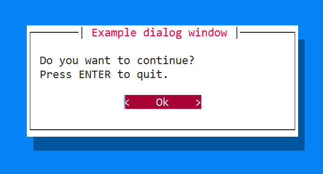
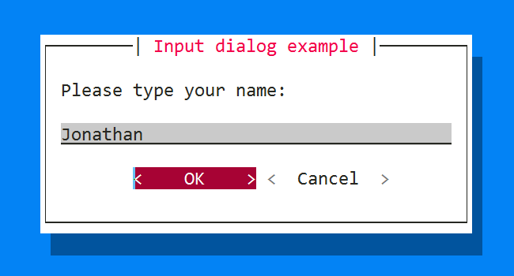
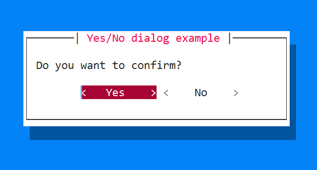
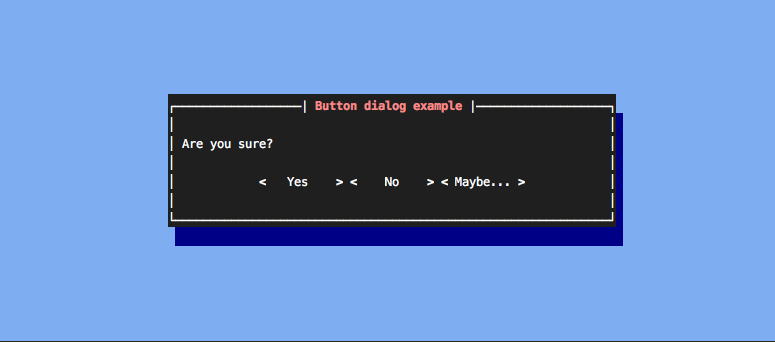
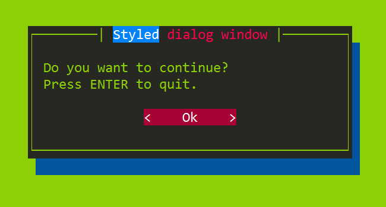

.. _dialogs:

Dialogs
=======

Prompt_toolkit ships with a high level API for displaying dialogs, similar to
the Whiptail program, but in pure Python.

Message box
-----------

Use the :func:`~prompt_toolkit.shortcuts.dialogs.message_dialog` function to
display a simple message box. For instance:

.. code:: python

    from prompt_toolkit.shortcuts.dialogs import message_dialog

    message_dialog(
        title='Example dialog window',
        text='Do you want to continue?\nPress ENTER to quit.')

Input box
---------

The :func:`~prompt_toolkit.shortcuts.dialogs.input_dialog` function can display
an input box. It will return the user input as a string.

.. code:: python

    from prompt_toolkit.shortcuts.dialogs import input_dialog

    text = input_dialog(
        title='Input dialog example',
        text='Please type your name:')

The ``password=True`` option can be passed to the
:func:`~prompt_toolkit.shortcuts.dialogs.input_dialog` function to turn this
into a password input box.

Yes/No confirmation dialog
--------------------------

The :func:`~prompt_toolkit.shortcuts.dialogs.yes_no_dialog` function displays a
yes/no confirmation dialog. It will return a boolean according to the
selection.

.. code:: python

    from prompt_toolkit.shortcuts.dialogs import yes_no_dialog

    result = yes_no_dialog(
        title='Yes/No dialog example',
        text='Do you want to confirm?')

Button dialog
--------------------------

The :func:`~prompt_toolkit.shortcuts.dialogs.button_dialog` function displays a
dialog with choices offered as buttons. Buttons are indicated as a list of
tuples, each providing the label (first) and return value if clicked (second).

.. code:: python

    from prompt_toolkit.shortcuts.dialogs import button_dialog

    result = button_dialog(
        title='Button dialog example',
        text='Do you want to confirm?',
        buttons=[
            ('Yes', True),
            ('No', False),
            ('Maybe...', None)
        ],
    )

Styling of dialogs
------------------

A custom :class:`~prompt_toolkit.styles.Style` instance can be passed to all
dialogs to override the default style. Also, text can be styled by passing an
:class:`~prompt_toolkit.formatted_text.HTML` object.

.. code:: python

    from prompt_toolkit.formatted_text import HTML
    from prompt_toolkit.shortcuts.dialogs import message_dialog
    from prompt_toolkit.styles import Style

    example_style = Style.from_dict({
        'dialog':             'bg:#88ff88',
        'dialog frame-label': 'bg:#ffffff #000000',
        'dialog.body':        'bg:#000000 #00ff00',
        'dialog.body shadow': 'bg:#00aa00',
    })

    message_dialog(
        title=HTML(' '
                   ' window'),
        text='Do you want to continue?\nPress ENTER to quit.',
        style=example_style)

