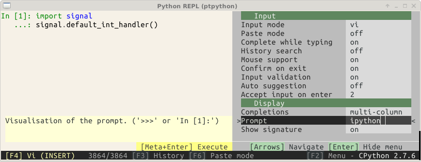
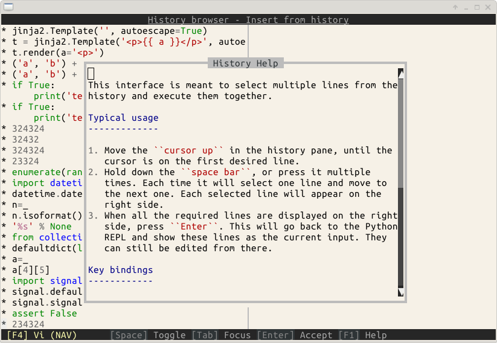
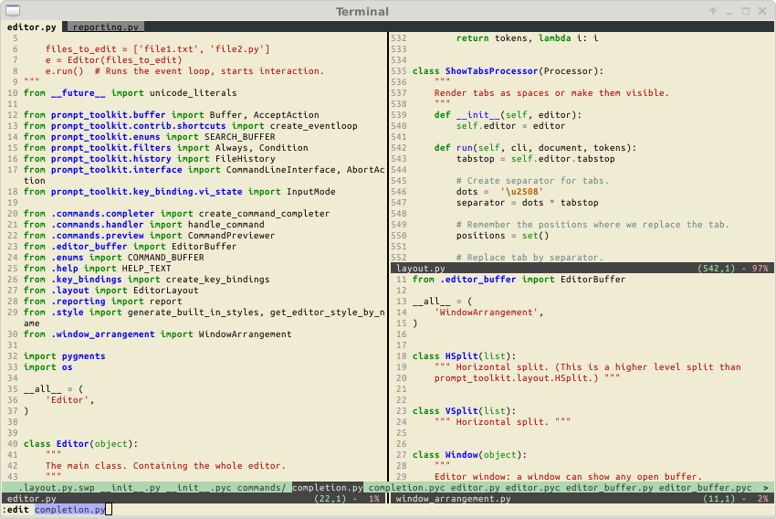
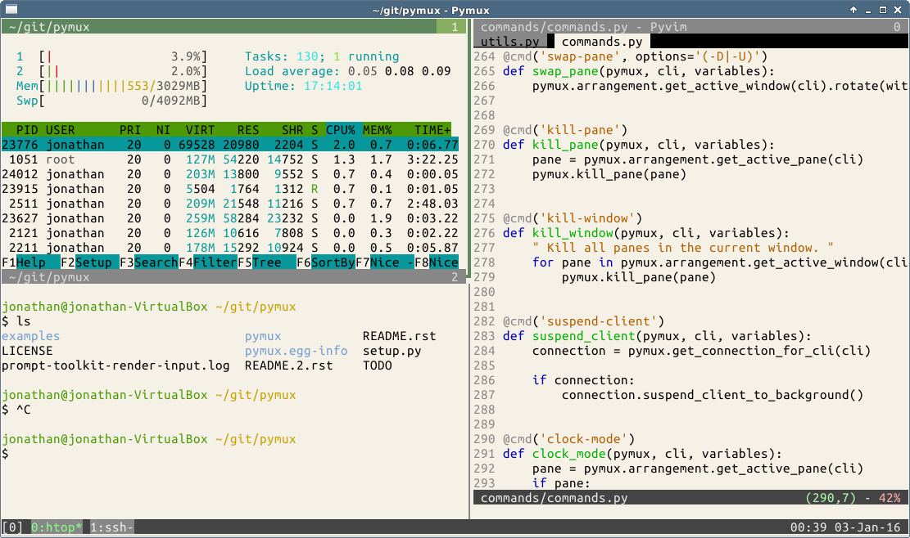

.. _gallery:

Gallery
=======

Showcase, demonstrating the possibilities of prompt_toolkit.

Ptpython, a Python REPL
^^^^^^^^^^^^^^^^^^^^^^^

The prompt:

.. image:: ../images/ptpython.png

The configuration menu of ptpython.

The history page with its help. (This is a full-screen layout.)

Pyvim, a Vim clone
^^^^^^^^^^^^^^^^^^

Pymux, a terminal multiplexer (like tmux) in Python
^^^^^^^^^^^^^^^^^^^^^^^^^^^^^^^^^^^^^^^^^^^^^^^^^^^

