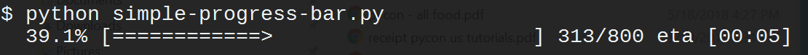
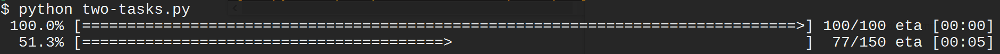
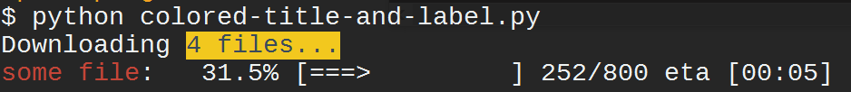
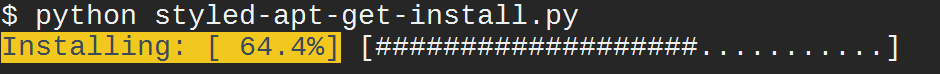
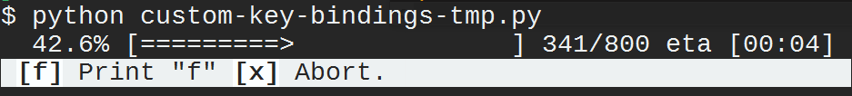

.. _progress_bars:

Progress bars
=============

Prompt_toolkit ships with a high level API for displaying progress bars,
inspired by `tqdm <https://github.com/tqdm/tqdm>`_ 

.. warning::

    The API for the prompt_toolkit progress bars is still very new and can
    possibly change in the future. It is usable and tested, but keep this in
    mind when upgrading.

Remember that the examples directory of the prompt_toolkit repository ships
with many progress bar examples as well.

Simple progress bar
-------------------

Creating a new progress bar can be done by calling the
:class:`~prompt_toolkit.shortcuts.ProgressBar` context manager.

The progress can be displayed for any iterable. This works by wrapping the
iterable (like ``range``) with the
:class:`~prompt_toolkit.shortcuts.ProgressBar` context manager itself. This
way, the progress bar knows when the next item is consumed by the forloop and
when progress happens.

.. code:: python

    from prompt_toolkit.shortcuts import ProgressBar
    import time

    with ProgressBar() as pb:
        for i in pb(range(800)):
            time.sleep(.01)

Keep in mind that not all iterables can report their total length. This happens
with a typical generator. In that case, you can still pass the total as follows
in order to make displaying the progress possible:

.. code:: python

    def some_iterable():
        yield ...

    with ProgressBar() as pb:
        for i in pb(some_iterable, total=1000):
            time.sleep(.01)

Multiple parallel tasks
-----------------------

A prompt_toolkit :class:`~prompt_toolkit.shortcuts.ProgressBar` can display the
progress of multiple tasks running in parallel. Each task can run in a separate
thread and the :class:`~prompt_toolkit.shortcuts.ProgressBar` user interface
runs in its own thread.

Notice that we set the "daemon" flag for both threads that run the tasks. This
is because control-c will stop the progress and quit our application. We don't
want the application to wait for the background threads to finish. Whether you
want this depends on the application.

.. code:: python

    from prompt_toolkit.shortcuts import ProgressBar
    import time
    import threading

    with ProgressBar() as pb:
        # Two parallel tasks.
        def task_1():
            for i in pb(range(100)):
                time.sleep(.05)

        def task_2():
            for i in pb(range(150)):
                time.sleep(.08)

        # Start threads.
        t1 = threading.Thread(target=task_1)
        t2 = threading.Thread(target=task_2)
        t1.daemon = True
        t2.daemon = True
        t1.start()
        t2.start()

        # Wait for the threads to finish. We use a timeout for the join() call,
        # because on Windows, join cannot be interrupted by Control-C or any other
        # signal.
        for t in [t1, t2]:
            while t.is_alive():
                t.join(timeout=.5)

Adding a title and label
------------------------

Each progress bar can have one title, and for each task an individual label.
Both the title and the labels can be :ref:`formatted text <formatted_text>`.

.. code:: python

    from prompt_toolkit.shortcuts import ProgressBar
    from prompt_toolkit.formatted_text import HTML
    import time

    title = HTML('Downloading ')
    label = HTML('<ansired>some file</ansired>: ')

    with ProgressBar(title=title) as pb:
        for i in pb(range(800), label=label):
            time.sleep(.01)

Formatting the progress bar
---------------------------

The visualisation of a :class:`~prompt_toolkit.shortcuts.ProgressBar` can be
customized by using a different sequence of formatters. The default formatting
looks something like this:

.. code:: python

    from prompt_toolkit.shortcuts.progress_bar.formatters import *

    default_formatting = [
        Label(),
        Text(' '),
        Percentage(),
        Text(' '),
        Bar(),
        Text(' '),
        Progress(),
        Text(' '),
        Text('eta [', style='class:time-left'),
        TimeLeft(),
        Text(']', style='class:time-left'),
        Text(' '),
    ]

That sequence of
:class:`~prompt_toolkit.shortcuts.progress_bar.formatters.Formatter` can be
passed to the `formatter` argument of
:class:`~prompt_toolkit.shortcuts.ProgressBar`. So, we could change this and
modify the progress bar to look like an apt-get style progress bar:

.. code:: python

    from prompt_toolkit.shortcuts import ProgressBar
    from prompt_toolkit.styles import Style
    from prompt_toolkit.shortcuts.progress_bar import formatters
    import time

    style = Style.from_dict({
        'label': 'bg:#ffff00 #000000',
        'percentage': 'bg:#ffff00 #000000',
        'current': '#448844',
        'bar': '',
    })

    custom_formatters = [
        formatters.Label(),
        formatters.Text(': [', style='class:percentage'),
        formatters.Percentage(),
        formatters.Text(']', style='class:percentage'),
        formatters.Text(' '),
        formatters.Bar(sym_a='#', sym_b='#', sym_c='.'),
        formatters.Text('  '),
    ]

    with ProgressBar(style=style, formatters=custom_formatters) as pb:
        for i in pb(range(1600), label='Installing'):
            time.sleep(.01)

Adding key bindings and toolbar
-------------------------------

Like other prompt_toolkit applications, we can add custom key bindings, by
passing a :class:`~prompt_toolkit.key_binding.KeyBindings` object:

.. code:: python

    from prompt_toolkit import HTML
    from prompt_toolkit.key_binding import KeyBindings
    from prompt_toolkit.patch_stdout import patch_stdout
    from prompt_toolkit.shortcuts import ProgressBar

    import time

    bottom_toolbar = HTML(' <b>[f]</b> Print "f" <b>[x]</b> Abort.')

    # Create custom key bindings first.
    kb = KeyBindings()
    cancel = [False]

    @kb.add('f')
    def _(event):
        print('You pressed `f`.')

    @kb.add('x')
    def _(event):
        " Send Abort (control-c) signal. "
        cancel[0] = True
        os.kill(os.getpid(), signal.SIGINT)

    # Use `patch_stdout`, to make sure that prints go above the
    # application.
    with patch_stdout():
        with ProgressBar(key_bindings=kb, bottom_toolbar=bottom_toolbar) as pb:
            for i in pb(range(800)):
                time.sleep(.01)

                # Stop when the cancel flag has been set.
                if cancel[0]:
                    break

Notice that we use :func:`~prompt_toolkit.patch_stdout.patch_stdout` to make
printing text possible while the progress bar is displayed. This ensures that
printing happens above the progress bar.

Further, when "x" is pressed, we set a cancel flag, which stops the progress.
It would also be possible to send `SIGINT` to the mean thread, but that's not
always considered a clean way of cancelling something.

In the example above, we also display a toolbar at the bottom which shows the
key bindings.

:ref:`Read more about key bindings ...<key_bindings>`
