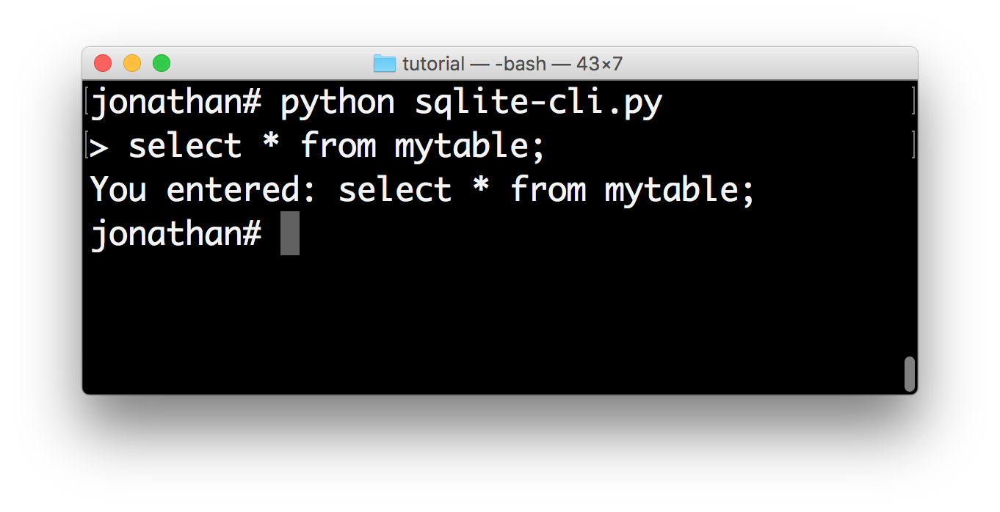
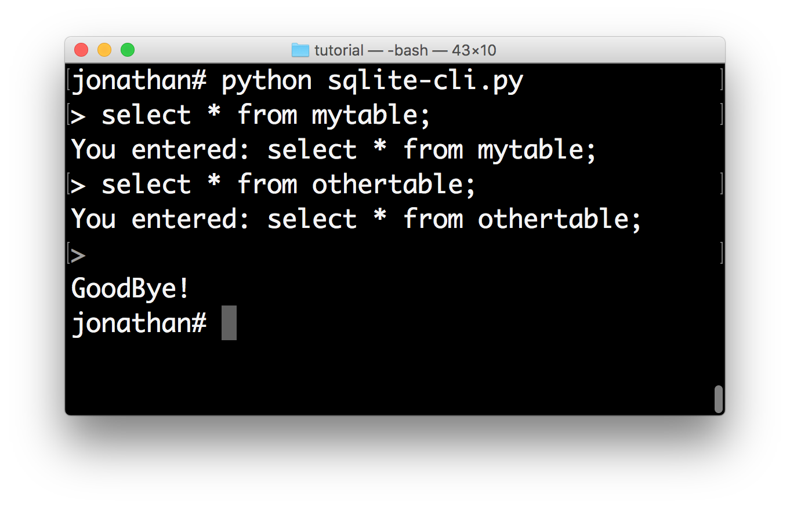
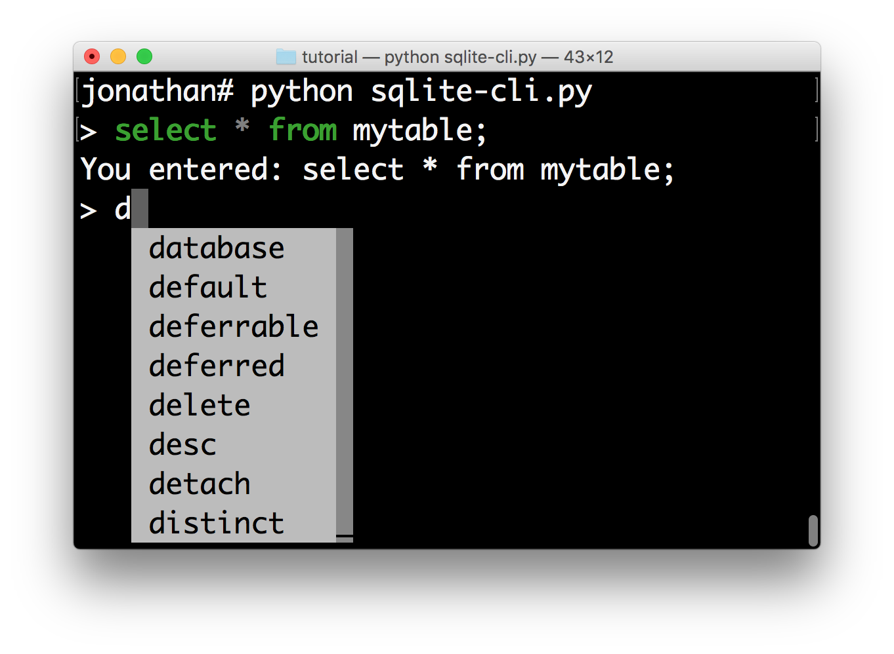
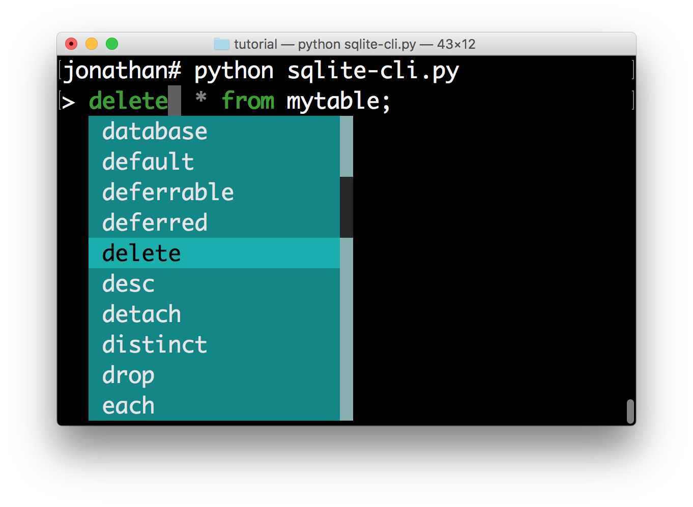
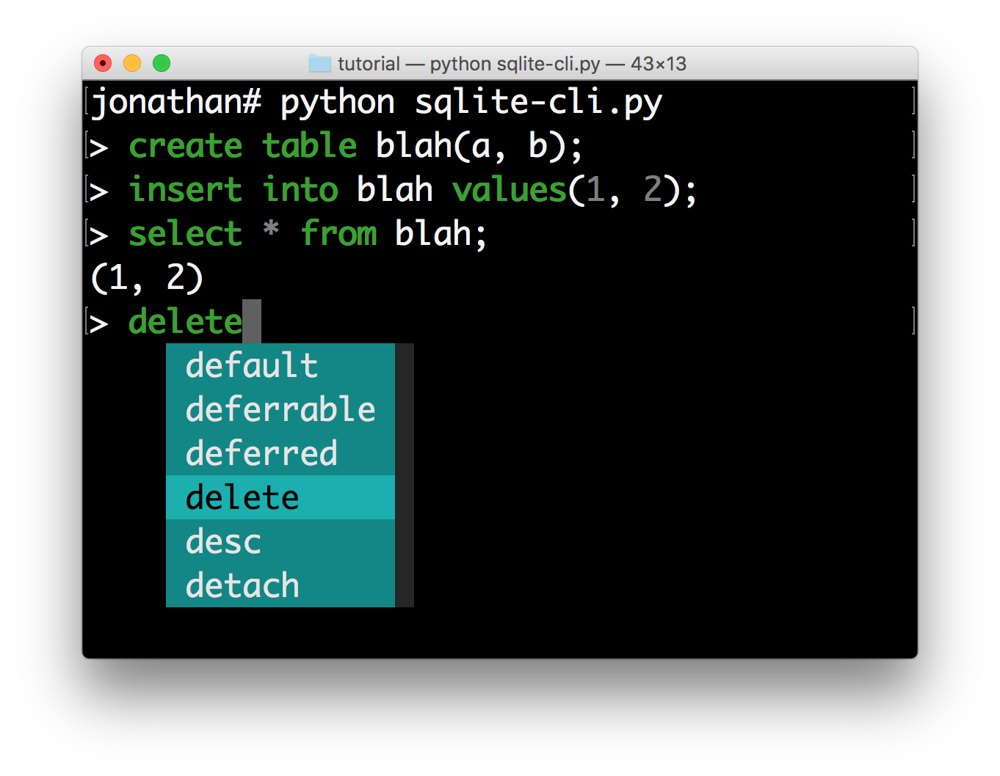

.. _tutorial_repl:

Tutorial: Build an SQLite REPL
==============================

The aim of this tutorial is to build an interactive command line interface for
an SQLite database using prompt_toolkit_.

First, install the library using pip, if you haven't done this already.

.. code::

    pip install prompt_toolkit

Read User Input
---------------

Let's start accepting input using the
:func:`~prompt_toolkit.shortcuts.prompt()` function. This will ask the user for
input, and echo back whatever the user typed. We wrap it in a ``main()``
function as a good practise.

.. code:: python

    from __future__ import unicode_literals
    from prompt_toolkit import prompt

    def main():
        text = prompt('> ')
        print('You entered:', text)

    if __name__ == '__main__':
        main()

Loop The REPL
-------------

Now we want to call the :meth:`~prompt_toolkit.shortcuts.PromptSession.prompt`
method in a loop. In order to keep the history, the easiest way to do it is to
use a :class:`~prompt_toolkit.shortcuts.PromptSession`. This uses an
:class:`~prompt_toolkit.history.InMemoryHistory` underneath that keeps track of
the history, so that if the user presses the up-arrow, he'll see the previous
entries.

The :meth:`~prompt_toolkit.shortcuts.PromptSession.prompt` method raises
``KeyboardInterrupt`` when ControlC has been pressed and ``EOFError`` when
ControlD has been pressed. This is what people use for cancelling commands and
exiting in a REPL. The try/except below handles these error conditions and make
sure that we go to the next iteration of the loop or quit the loop
respectively.

.. code:: python

    from __future__ import unicode_literals
    from prompt_toolkit import PromptSession

    def main():
        session = PromptSession()

        while True:
            try:
                text = session.prompt('> ')
            except KeyboardInterrupt:
                continue
            except EOFError:
                break
            else:
                print('You entered:', text)
        print('GoodBye!')

    if __name__ == '__main__':
        main()

Syntax Highlighting
-------------------

This is where things get really interesting. Let's step it up a notch by adding
syntax highlighting to the user input. We know that users will be entering SQL
statements, so we can leverage the Pygments_ library for coloring the input.
The ``lexer`` parameter allows us to set the syntax lexer. We're going to use
the ``SqlLexer`` from the Pygments_ library for highlighting.

Notice that in order to pass a Pygments lexer to prompt_toolkit, it needs to be
wrapped into a :class:`~prompt_toolkit.lexers.PygmentsLexer`.

.. code:: python

    from __future__ import unicode_literals
    from prompt_toolkit import PromptSession
    from prompt_toolkit.lexers import PygmentsLexer
    from pygments.lexers import SqlLexer

    def main():
        session = PromptSession(lexer=PygmentsLexer(SqlLexer)

        while True:
            try:
                text = session.prompt('> ')
            except KeyboardInterrupt:
                continue
            except EOFError:
                break
            else:
                print('You entered:', text)
        print('GoodBye!')

    if __name__ == '__main__':
        main()

.. image:: ../../images/repl/sqlite-3.png

Auto-completion
---------------

Now we are going to add auto completion. We'd like a drop down menu of
`possible keywords <https://www.sqlite.org/lang_keywords.html>`_ when the user
is typing.

Create your ``sql_completer`` instance from the ``WordCompleter`` class
defining a set of ``keywords`` for auto-completion.

Like the lexer, this ``sql_completer`` instance can be passed to either the
:class:`~prompt_toolkit.shortcuts.PromptSession` class or the
:meth:`~prompt_toolkit.shortcuts.PromptSession.prompt` method

.. code:: python

    from __future__ import unicode_literals
    from prompt_toolkit import PromptSession
    from prompt_toolkit.completion import WordCompleter
    from prompt_toolkit.lexers import PygmentsLexer
    from pygments.lexers import SqlLexer

    sql_completer = WordCompleter([
        'abort', 'action', 'add', 'after', 'all', 'alter', 'analyze', 'and',
        'as', 'asc', 'attach', 'autoincrement', 'before', 'begin', 'between',
        'by', 'cascade', 'case', 'cast', 'check', 'collate', 'column',
        'commit', 'conflict', 'constraint', 'create', 'cross', 'current_date',
        'current_time', 'current_timestamp', 'database', 'default',
        'deferrable', 'deferred', 'delete', 'desc', 'detach', 'distinct',
        'drop', 'each', 'else', 'end', 'escape', 'except', 'exclusive',
        'exists', 'explain', 'fail', 'for', 'foreign', 'from', 'full', 'glob',
        'group', 'having', 'if', 'ignore', 'immediate', 'in', 'index',
        'indexed', 'initially', 'inner', 'insert', 'instead', 'intersect',
        'into', 'is', 'isnull', 'join', 'key', 'left', 'like', 'limit',
        'match', 'natural', 'no', 'not', 'notnull', 'null', 'of', 'offset',
        'on', 'or', 'order', 'outer', 'plan', 'pragma', 'primary', 'query',
        'raise', 'recursive', 'references', 'regexp', 'reindex', 'release',
        'rename', 'replace', 'restrict', 'right', 'rollback', 'row',
        'savepoint', 'select', 'set', 'table', 'temp', 'temporary', 'then',
        'to', 'transaction', 'trigger', 'union', 'unique', 'update', 'using',
        'vacuum', 'values', 'view', 'virtual', 'when', 'where', 'with',
        'without'], ignore_case=True)

    def main():
        session = PromptSession(
            lexer=PygmentsLexer(SqlLexer), completer=sql_completer)

        while True:
            try:
                text = session.prompt('> ')
            except KeyboardInterrupt:
                continue
            except EOFError:
                break
            else:
                print('You entered:', text)
        print('GoodBye!')

    if __name__ == '__main__':
        main()

In about 30 lines of code we got ourselves an auto completing, syntax
highlighting REPL. Let's make it better.

Styling the menus
-----------------

If we want, we can now change the colors of the completion menu. This is
possible by creating a :class:`~prompt_toolkit.styles.Style` instance and
passing it to the :meth:`~prompt_toolkit.shortcuts.PromptSession.prompt`
function.

.. code:: python

    from __future__ import unicode_literals
    from prompt_toolkit import PromptSession
    from prompt_toolkit.completion import WordCompleter
    from prompt_toolkit.lexers import PygmentsLexer
    from prompt_toolkit.styles import Style
    from pygments.lexers import SqlLexer

    sql_completer = WordCompleter([
        'abort', 'action', 'add', 'after', 'all', 'alter', 'analyze', 'and',
        'as', 'asc', 'attach', 'autoincrement', 'before', 'begin', 'between',
        'by', 'cascade', 'case', 'cast', 'check', 'collate', 'column',
        'commit', 'conflict', 'constraint', 'create', 'cross', 'current_date',
        'current_time', 'current_timestamp', 'database', 'default',
        'deferrable', 'deferred', 'delete', 'desc', 'detach', 'distinct',
        'drop', 'each', 'else', 'end', 'escape', 'except', 'exclusive',
        'exists', 'explain', 'fail', 'for', 'foreign', 'from', 'full', 'glob',
        'group', 'having', 'if', 'ignore', 'immediate', 'in', 'index',
        'indexed', 'initially', 'inner', 'insert', 'instead', 'intersect',
        'into', 'is', 'isnull', 'join', 'key', 'left', 'like', 'limit',
        'match', 'natural', 'no', 'not', 'notnull', 'null', 'of', 'offset',
        'on', 'or', 'order', 'outer', 'plan', 'pragma', 'primary', 'query',
        'raise', 'recursive', 'references', 'regexp', 'reindex', 'release',
        'rename', 'replace', 'restrict', 'right', 'rollback', 'row',
        'savepoint', 'select', 'set', 'table', 'temp', 'temporary', 'then',
        'to', 'transaction', 'trigger', 'union', 'unique', 'update', 'using',
        'vacuum', 'values', 'view', 'virtual', 'when', 'where', 'with',
        'without'], ignore_case=True)

    style = Style.from_dict({
        'completion-menu.completion': 'bg:#008888 #ffffff',
        'completion-menu.completion.current': 'bg:#00aaaa #000000',
        'scrollbar.background': 'bg:#88aaaa',
        'scrollbar.button': 'bg:#222222',
    })

    def main():
       session = PromptSession(
           lexer=PygmentsLexer(SqlLexer), completer=sql_completer, style=style)

       while True:
           try:
               text = session.prompt('> ')
           except KeyboardInterrupt:
               continue
           except EOFError:
               break
           else:
               print('You entered:', text)
       print('GoodBye!')

    if __name__ == '__main__':
        main()

All that's left is hooking up the sqlite backend, which is left as an exercise
for the reader. Just kidding... Keep reading.

Hook up Sqlite
--------------

This step is the final step to make the SQLite REPL actually work. It's time
to relay the input to SQLite.

Obviously I haven't done the due diligence to deal with the errors. But it
gives a good idea of how to get started.

.. code:: python

    #!/usr/bin/env python
    from __future__ import unicode_literals
    import sys
    import sqlite3

    from prompt_toolkit import PromptSession
    from prompt_toolkit.completion import WordCompleter
    from prompt_toolkit.lexers import PygmentsLexer
    from prompt_toolkit.styles import Style
    from pygments.lexers import SqlLexer

    sql_completer = WordCompleter([
        'abort', 'action', 'add', 'after', 'all', 'alter', 'analyze', 'and',
        'as', 'asc', 'attach', 'autoincrement', 'before', 'begin', 'between',
        'by', 'cascade', 'case', 'cast', 'check', 'collate', 'column',
        'commit', 'conflict', 'constraint', 'create', 'cross', 'current_date',
        'current_time', 'current_timestamp', 'database', 'default',
        'deferrable', 'deferred', 'delete', 'desc', 'detach', 'distinct',
        'drop', 'each', 'else', 'end', 'escape', 'except', 'exclusive',
        'exists', 'explain', 'fail', 'for', 'foreign', 'from', 'full', 'glob',
        'group', 'having', 'if', 'ignore', 'immediate', 'in', 'index',
        'indexed', 'initially', 'inner', 'insert', 'instead', 'intersect',
        'into', 'is', 'isnull', 'join', 'key', 'left', 'like', 'limit',
        'match', 'natural', 'no', 'not', 'notnull', 'null', 'of', 'offset',
        'on', 'or', 'order', 'outer', 'plan', 'pragma', 'primary', 'query',
        'raise', 'recursive', 'references', 'regexp', 'reindex', 'release',
        'rename', 'replace', 'restrict', 'right', 'rollback', 'row',
        'savepoint', 'select', 'set', 'table', 'temp', 'temporary', 'then',
        'to', 'transaction', 'trigger', 'union', 'unique', 'update', 'using',
        'vacuum', 'values', 'view', 'virtual', 'when', 'where', 'with',
        'without'], ignore_case=True)

    style = Style.from_dict({
        'completion-menu.completion': 'bg:#008888 #ffffff',
        'completion-menu.completion.current': 'bg:#00aaaa #000000',
        'scrollbar.background': 'bg:#88aaaa',
        'scrollbar.button': 'bg:#222222',
    })

    def main(database):
        connection = sqlite3.connect(database)
        session = PromptSession(
            lexer=PygmentsLexer(SqlLexer), completer=sql_completer, style=style)

        while True:
            try:
                text = session.prompt('> ')
            except KeyboardInterrupt:
                continue  # Control-C pressed. Try again.
            except EOFError:
                break  # Control-D pressed.

            with connection:
                try:
                    messages = connection.execute(text)
                except Exception as e:
                    print(repr(e))
                else:
                    for message in messages:
                        print(message)

        print('GoodBye!')

    if __name__ == '__main__':
        if len(sys.argv) < 2:
            db = ':memory:'
        else:
            db = sys.argv[1]

        main(db)

I hope that gives an idea of how to get started on building command line
interfaces.

The End.

.. _prompt_toolkit: https://github.com/jonathanslenders/python-prompt-toolkit
.. _Pygments: http://pygments.org/
